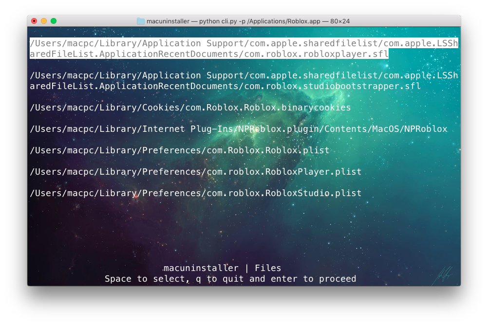

macuninstaller
-------------
macuninstaller is a python script that was written to uninstall mac apps. This script finds all the related files and folders and deletes them for you. You can use both the GUI version and CLI version of macuninstaller. 

Download
-----
**MACUNINSTALLER EXISTS AS BOTH APP AND BINARY FILE, SO GET WHAT PLEASES YOU FROM RELEASES** You can checkout the latest releases and can even download the binary from there  `https://github.com/hrik2001/macuninstaller/releases/` 
And move the binary to this path so that you can directly use it as a command in your terminal :)- 
`/usr/local/bin/` 
 

Or you can download this repository.  
`git clone https://github.com/hrik2001/macuninstaller`  

Usage
-----
If you are using the python script then type this- 
`python cli.py -p /path/to/app`   Or this if you are using the binary  `macuninstaller -p /path/to/app`
and it will output the possible files and folders that are related to the app you just specified.  
You can also do a custom scan where you have to type the path of the app and the directories in which you want to search for files affiliated with the app.  
`python cli.py -p /path/to/app -c /path1/ /path2/ /path3/`  And for the binary -   `macuninstaller -p /path/to/app -c /path1/ /path2/ /path3/` 
For the GUI version, just run  
`python macuninstaller.py` 

UI Help
----
The CLI version is very user friendly, here is a peek :) 
 
The CLI version lets you choose the files and folders by using up and down arrow keys, if you want to select/deselect files/folders you can do so with space, if you want to quit the program then press "q". After that you will be asked to type your password and with a breeze your app will be uninstalled. 
Here is the look of the GUI **NOTE: YOU HAVE TO RUN THE SCRIPT IN SUDO** 
First you have to choose what kind of scan do you want to have for the app you want to uninstall  
 
For both of the scans you will be greeted with 
 
For custom scan you would be greeted with this window where it would ask you to type folder names, seperated by comma . macuninstaller will search in those folders. Suggested folders already appear in text field 
 
Also you will have a suggestor feature which will suggest if the file/folder should be deleted or not. The confused emoji shows that it is not suggested to delete the file and the smiley face for vice versa 
 

Contribution
------------
[hexx112](https://www.reddit.com/user/hexx112) for making the website which is accessible at [macuninstaller](https://hrik2001.github.io/macuninstaller)
